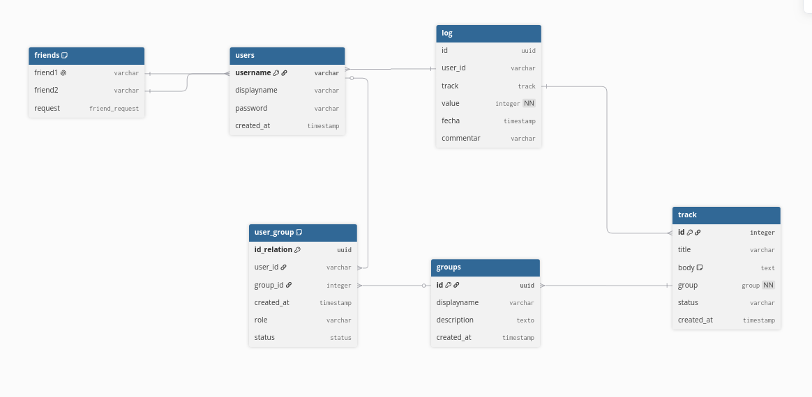

d# Tracker de actividades 

El objetivo de este trabajo es armar software para rastrear y comparar entre grupos de amigos las frecuencias y horarios en que ocurre un evento o acción dada para cada persona. Además, puede tomar, agrupar y analizar estadísticas del grupo con varias representaciones visuales. Esto puede servir, por ejemplo, para mantenerse al día con el progreso en grupos de estudio o de lectura, o solo por entretenimiento midiendo acciones cotidianas. 

## uso

`docker-compose -f docker-compose.combined.yml up -d && \ docker exec -it aida26_app npm run seed-example `

Para que tenga datos de ejemplo precargados.

## Proceso de modelado

Para modelar la base de datos usamos el siguiente diagrama

Decidimos agregar una tabla de _friends_ porque queríamos que solamente los amigos puedan agregar a gente al grupo, para evitar spam.

Para evitar que se dupliquen los amigos, el nombre de usuario (PK) del primero en la relación mayor al segundo. Esto usa un constraint en la base de datos. El tipo friend_request que usa es un enum con {accepted, rejected, pending_from_higher, pending_from_lower} para permitir esto.

Decidimos no validación en la página de administración para evitar estados ilegales porque qué sería un estado ilegal es demasiado complicado para representar en contraints y hacerlo por el lado del backend necesitaria funciones específicas para cada acción, lo cual violaria el SRP si quisiéramos modificar la base de datos a futuro. No nos parece problemático porque esos cambios se pueden hacer de manera correcta asegurada usando la funcionalidad de downgrade, explicada más adelante. 

Decidimos cambiar la PK de auth.users a un varchar de nombre de usuario para mejorar compatibilidad con la pantalla de administración. 

## UX
Nos aseguramos que el estado de la página sea accesible desde el URL.

También, usamos una estética uniforme para el usuario entienda de forma sencilla su propósito

En el login, al pasar de login a register mantenemos los valores de los inputs para ayudar al usuario en caso de equivocarse. 
 
No nos pareció que hubiera ningún otro formulario donde hay pérdida de información relevante en el caso de pérdida de sesión.

Para las estadísticas, decidimos calcularlas en queries de sql del backend para aprovechar la eficiencia de la base de datos, en vez de procesar la información en el frontend en base a datos puros. 

Nos aseguramos que cualquier acción que no se pueda deshacer (eliminar grupos, actividades, amigos) tenga pantalla de confirmación. Consideramos que rechazar una solicitud es algo que se puede deshacer, por lo cual no lo incluimos.

## Seguridad

Usamos usuarios de la base de datos diferentes con niveles de permisos diferentes para usuarios normales, admins, y autenticación. Usamos seguridad por columnas para que la información que pueden acceder users y admins en auth.users sea solo la que corresponda. 

Decidimos no proteger datos personales de la vista del admin, porque el host siempre tiene acceso a los datos desde la DB directamente. Si implementáramos a futuro encriptación por grupo E2E esto cambiaría. 
Dado que los admins ya pueden hacer y modificar cualquier cosa como si fueran los usuarios mismos, le permitimos downgradear al admin a el rol de cualquier usuario para tener mejor UX para modificar datos si es necesario. Esto, otra vez, se eliminaría en un sistema más seguro, pero por ahora tiene sentido.

Los usuarios de un grupo tienen como posible estado: 'invited', 'active', 'left'. Dejamos esos porque: invited sería esperando a que el usuario acepte, pero ya lo agregamos a la tabla, active no hace explicar, left porque no borramos su información cuando sale del grupo. 

## Proceso de desarrollo

Agregamos un endpoint especializado para contar la cantidad de filas en las tablas, para aprovechar el compilador de la base de datos y que no dé toda la información innecesaria

## Endpoints Propios

* **`GET /api/tracker/users`**: Retorna el listado completo de usuarios registrados (username y displayname) ordenados alfabéticamente. *(Requiere autenticación)*.
* **`GET /api/tracker/groups`**: Obtiene los grupos activos en los que participa el usuario logueado. *(Requiere autenticación)*.
* **`POST /api/tracker/groups`**: Crea un nuevo grupo de seguimiento de actividades y define al creador como administrador del mismo. *(Requiere autenticación)*.
* **`POST /api/tracker/groups/:groupId/invite`**: Envía una invitación para unirse al grupo a otro usuario del sistema. *(Requiere autenticación y ser administrador del grupo)*.
* **`POST /api/tracker/groups/:groupId/invite/respond`**: Permite responder (`accepted` o `rejected`) a una invitación de grupo pendiente. *(Requiere autenticación)*.
* **`GET /api/tracker/invitations`**: Retorna la lista de invitaciones a grupos que tiene pendientes de respuesta el usuario logueado. *(Requiere autenticación)*.
* **`GET /api/tracker/users/:username/invitations`**: Retorna las invitaciones pendientes de un usuario específico. *(Requiere autenticación; accesible por el propio usuario o administradores globales)*.
* **`GET /api/tracker/groups/:groupId/invitations`**: Retorna la lista de invitaciones pendientes de aceptación de un grupo. *(Requiere autenticación y ser administrador del grupo)*.
* **`GET /api/tracker/groups/:groupId/members`**: Retorna los miembros y sus roles/estados dentro del grupo especificado. *(Requiere autenticación y ser miembro activo del grupo)*.
* **`GET /api/tracker/groups/:groupId/activities`**: Obtiene todas las actividades registradas de un grupo. *(Requiere autenticación y ser miembro activo del grupo)*.
* **`POST /api/tracker/groups/:groupId/activities`**: Agrega una nueva actividad a un grupo. *(Requiere autenticación y ser administrador del grupo)*.
* **`GET /api/tracker/groups/:groupId/activities/:activityTitle/records`**: Obtiene todos los logs/registros cargados en una actividad específica de un grupo. *(Requiere autenticación y ser miembro activo del grupo)*.
* **`POST /api/tracker/groups/:groupId/activities/:activityTitle/records`**: Registra un nuevo log de progreso en una actividad (valor numérico, fecha y comentario opcional). *(Requiere autenticación y ser miembro activo del grupo)*.
* **`GET /api/tracker/groups/:groupId/activities/:activityTitle/comparisons`**: Compara la suma total de valores registrados por cada usuario activo en una actividad, ordenado de mayor a menor. *(Requiere autenticación y ser miembro activo del grupo)*.
* **`GET /api/tracker/groups/:groupId/activities/:activityTitle/stats`**: Retorna estadísticas consolidadas de la actividad (resumen general, desglose por usuario, desglose por usuario por mes, agregación diaria y los registros históricos). *(Requiere autenticación y ser miembro activo del grupo)*.
* **`GET /api/tracker/friends`**: Lista los amigos aceptados del usuario logueado, así como las solicitudes de amistad pendientes enviadas y recibidas. *(Requiere autenticación)*.
* **`POST /api/tracker/friends/request`**: Envía una solicitud de amistad a otro usuario. *(Requiere autenticación)*.
* **`POST /api/tracker/friends/respond`**: Responde (`accepted` o `rejected`) a una solicitud de amistad recibida. *(Requiere autenticación)*.
* **`GET /api/tracker/logs`**: Obtiene los últimos 50 registros cargados por el usuario actual en cualquiera de sus actividades. *(Requiere autenticación)*.
* **`GET /api/tracker/stats`**: Devuelve estadísticas de resumen del usuario (cantidad de grupos activos, amigos aceptados y registros totales cargados), ejecutando consultas SQL optimizadas de conteo rápido. *(Requiere autenticación)*.
* **`DELETE /api/tracker/groups/:groupId/members/:userId`**: Expulsa a un miembro del grupo (si el solicitante es administrador del grupo) o permite al propio usuario abandonar el grupo. *(Requiere autenticación y ser miembro activo)*.
* **`DELETE /api/tracker/groups/:groupId`**: Elimina un grupo del sistema y todas sus dependencias. *(Requiere autenticación y ser administrador del grupo)*.
* **`DELETE /api/tracker/groups/:groupId/activities/:activityTitle`**: Elimina una actividad del grupo y sus logs de progreso asociados. *(Requiere autenticación y ser administrador del grupo)*.
* **`DELETE /api/tracker/groups/:groupId/activities/:activityTitle/records/:recordId`**: Elimina un log o registro de actividad específico. *(Requiere autenticación; accesible por el creador del registro o el administrador del grupo)*.
* **`DELETE /api/tracker/friends/:username`**: Elimina una amistad existente o cancela una solicitud. *(Requiere autenticación)*.

## Aprendizajes

+ Postgres en Windows hay que tener en cuenta que si lo tenés activo el servicio y abris el postgresql, entonces va a ir al que tengas local y no en docker, generando conflictos
+ No poner que retorne 200 si no está implementado
+ Desde 2023 existe una propiedad de CSS que permite deshabilitar el boton de submit visualmente cuando el form no cumple los requisitos. La IA no la sabe usar si no se lo pedis explicitamente. 
+ Es muy importante tener los diagramas de esquemas actualizados con los cambios que se hagan para no equivocarse.
+ Para instalar PostgreSQL no hace falta ser Sudo, pero cuando queres cerrarlo te pide permisos de sudo. 

